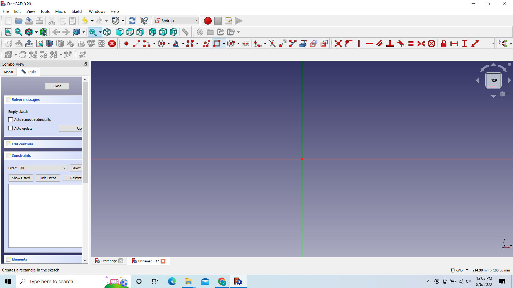
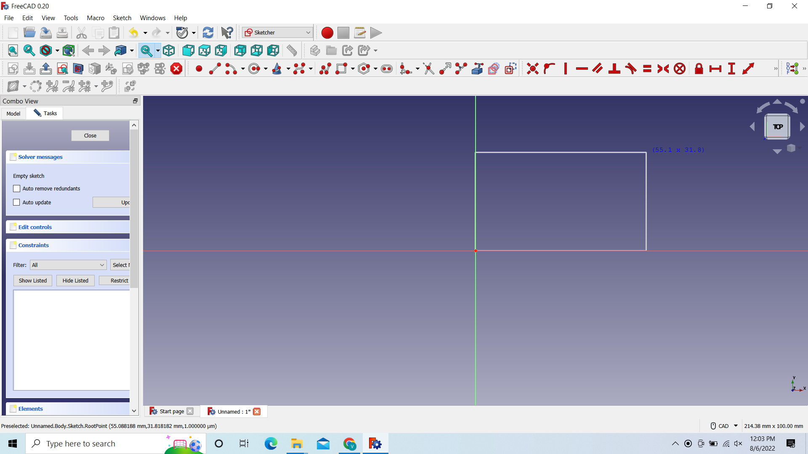

<link rel="shortcut icon" type="image/png" href="favicon.png">

<h1>Varun Brahmadin's Documentation</h1>

<a href="#CB1">Chapter 1.</a> 

<a href="#CB2">Chapter 2.</a> 

<a href="#CB3">Chapter 3.</a> 

<a href="#CB4">Chapter 4.</a> 

<a href="#CB5">Chapter 5.</a> 

<a href="#CB6">Chapter 6.</a> 

<a href="#CB7">Chapter 7.</a> 

<a href="#CB8">Chapter 8.</a> 

<a href="#CB9">Chapter 9.</a> 

<a href="#CB10">Chapter 10.</a> 

<a href="#CB11">Chapter 11.</a> 

<a href="#CB12">Chapter 12.</a> 

<a href="#CB13">Chapter 13.</a> 


<a id="CB10">
<br><h1> chapter 10. Interface & Application Programming </h1></a>
<br>Objectives
<br>Wk 1
<br>[x] Setup Dev Environment for ESP32 S2
<br>[x] Setup NodeJS Dev Environment on your PC
<br>[ ] Explain the HackOmation quadrant in relation to your final project.
<br>[x] Build UI mockups for your FInal Project and HTML Layout
<br>Wk 2
<br>[x] Build HTML5 Chat app
<br> Draw mockup / layout
<br> frame and add id’s to ```<div>```’s
<br> Style the page and 
<br> wire up the JS code and understand
<br>Wk 3
<br>[ ] Build Chat app back-end NodeJS
<br>Build NodeJS server side to: 
<br> host your ChatApp (Express static HTML)
<br> Build / test API endpoints (for: users & messages)
<br>Wk 4
<br>[ ] Setup MongoDB datastore & connect via NodeJS
<br> Setup MongoDB datastore + mongoose ODM (Object-Document-Manager)
<br> Store and recall message data using an API (ex. request top 100 msg)
<br> Wire up MongoDB to API endpoints
<br>Update app-flow to use back-end for Users and “old” messages
<br>Wk 5
<br>[ ] Create data-bound widgets to display sensor data
<br> On ESP32 add MQTT client + ArduinoJSON
<br> Send Sensor data to MQTT server (as a JSON object)
<br> Create a DataCard, a Gauge and a time Chart widget on Dashboard (use chat app)
<br> Strategy on DataBinding and Widget updating (Last updated)
<br>User Login/Pw (state persistence)
<br>[x] Add Screenshots and description of the process of creating your board.
<br>[x] Describe the design & programming steps
<br>[x] Screenshots or video of your Prototype/app working
<br>[x] Describe any errors or problems with the process and how you fixed them. 
<br>[x] Include all the files you created for download.

10.1 Build HTML5 Chat app
---------------------------

<br>So our objective was to build a chat app with a mqtt server. We first started by installing mqtt lens so we can connect to a public server. After that we made our mockups(pic 1) and put the drawings into code. After that we connected to the mqtt server with javascript, to make sure we had a connection. After that it was just adding functions and building a front end for it. After I connected to the mqtt server(pic2), I could send and receive messages(pic3).  I worked on the front end and styled it with css(pic 4)


      
<br>Here we have my mockup  
<br>

<br>After that we build our app with just the tags and the basic setup and connected it with a basic script. 

<br>After we had connected to the mqtt server, It was just a matter of styling and building extra features, 
<br>In the first picture, i have already connect to the mqtt server, but i couldnt send messages. Was a coding error, but it got fixed pretty soon
<br>

<br>In the second picture, I can now write from the chat app and also read, So i had the basics covered
<br>


<br>In the last pic i just styled it with css
<br>

<br>Problems  
<ul>
<li>mqtt server</li>
<li>Lessons learned</li>
<li>I got my web dev skills back, i forgot most of the tags tbh, but yeah refreshed it, Owh i learned javascript i never really went into that, and i also got working with mqtt servers and how those work</li>
</ul>
<br>Files & Downloads

<li>Chatapp.html</li>
<li>Style.css</li>
<li>app.js</li>

<br>Code:

```
<!DOCTYPE html>
<html lang="en">
<head>


<script src="https://cdnjs.cloudflare.com/ajax/libs/paho-mqtt/1.0.1/mqttws31.js" type="text/javascript"></script>
<script src="https://cdnjs.cloudflare.com/ajax/libs/mqtt/4.3.7/mqtt.min.js" type="text/javascript"></script>
<link rel="stylesheet" href="https://cdnjs.cloudflare.com/ajax/libs/font-awesome/4.7.0/css/font-awesome.min.css">


<link rel="stylesheet" href="https://cdn.jsdelivr.net/npm/bootstrap@4.0.0/dist/css/bootstrap.min.css" integrity="sha384-Gn5384xqQ1aoWXA+058RXPxPg6fy4IWvTNh0E263XmFcJlSAwiGgFAW/dAiS6JXm" crossorigin="anonymous">


<title>Chatt app</title>
<!--<link rel="icon" type="image/x-icon" href="logo.png"> -->
<meta charset="utf-8">
<meta name="viewport" content="width=device-width, initial-scale=1">


<style>

* {
  box-sizing: border-box;
}

body {
  font-family: Arial, Helvetica, sans-serif;
}

/* Style the header */
header {
  background-color: #d3d3d3;
  padding: 30px;
  text-align: center;
  font-size: 35px;
  color: white;
}

/* Create two columns/boxes that floats next to each other */
aside {
  float: left;
  width: 15%;
  height: 326px; /* only for demonstration, should be removed */
  background: #ccc;
  padding: 20px;
}

/* Style the list inside the menu */
nav ul {
  list-style-type: none;
  padding: 0;
}

article {
  float: left;
  padding: 20px;
  width: 85%;
  background-color:#524f4f;
  overflow:auto;

  height: 326px; /* only for demonstration, should be removed */
}

/* Clear floats after the columns */
section::after {
  content: "";
  display: table;
  clear: both;

}

/* Style the footer */
footer {
  background-color: #777;
  padding: 10px;
  text-align: center;
  color: white;
}

/* Responsive layout - makes the two columns/boxes stack on top of each other instead of next to each other, on small screens */
@media (max-width: 600px) {
  nav, article {
    width: 100%;
    height: auto;
  }
}


#cbox{

 align: bottom;

}

.cinput, select {
  width: 100%;
  padding: 12px 20px;
  margin: 8px 0;
  display: inline-block;
  border: 1px solid #ccc;
  border-radius: 4px;
  box-sizing: border-box;
}


#submit {
  width: 100%;
  background-color: #4CAF50;
  color: white;
  padding: 14px 20px;
  margin: 8px 0;
  border: none;
  border-radius: 4px;
  cursor: pointer;
}

#submit:hover {
  background-color: #45a049;
}


.navbar {
  width: 100%;
  background-color: #555;
  overflow: auto;
}

.navbar a {
  float: left;
  padding: 12px;
  color: white;
  text-decoration: none;
  font-size: 17px;
}

.navbar a:hover {
  background-color: #000;
}

.active {
  background-color: #04AA6D;
}

@media screen and (max-width: 500px) {
  .navbar a {
    float: none;
    display: block;
  }
}


h5{

background-color: black;
color: white;
padding: 6px 7px 8px 9px;
box-sizing: border-box;
  
}

.list-group list-group-flush{
background-color:black;


}


.pp {
  border: none;
  color: black;
  #padding: 8px 16px;
  text-align: center;
  text-decoration: none;
  display: inline-block;
  font-size: 14px;
  margin: 0px 4px;
  cursor: pointer;
  float: left;
}

.con {
  border: none;
  color: black;
  #padding: 8px 16px;
  text-align: center;
  text-decoration: none;
  display: inline-block;
  font-size: 14px;
  margin: 0px 4px;
  cursor: pointer;
  float: left;
}


</style>

</head>
<body>

<div class="navbar">
  <a class="active" href="#"><i class="fa fa-fw fa-home"></i> Home</a> 
  <a href="#"><i class="fa fa-fw fa-search" ></i> Search</a> 
  <a href="#"><i class="fa fa-fw fa-envelope"></i> Contact</a> 
  <a href="#"><i class="fa fa-fw fa-user"></i> Login</a>
  <input id ="username" class="usernam" type="text" placeholder="Type a message"></input>
</div>


<header>
  <h3>Chatapp</h3>
  <button  class="pp" onclick="connect(sendPing())">Ping </button>
  <button class="pp" onclick="sendPong()">Pong </button>
  <button class="con" onclick="connect()">connect </button>
</header>

<section>
 <aside>
 <h1>Users</h1>
 <div id="userlist"></div> 

  </aside>

   <article id="chatlog">
    <h1>Chats</h1>
  </article>

</section>


<footer >
  <input id ="chatInput" class="cinput" type="text" placeholder="Type a message" onkeydown="sendMsg(this)"></input><br>
  
<button id="submit"  onclick="sendMessageButton(getElementById('chatInput').value); getElementById('chatInput').value='';">Submit </button>

</footer>
<script>


	// Chat app MQTT settings
	var mqttServer = "ws://broker.hivemq.com:8000/mqtt";
	var mqttTopic= "codettes2022";
	var userName = document.getElementById("username").value ||"Varun";
	const clientId = 'cb22_' + Math.random().toString(16).substr(2, 8)
	var userList = [];

//var client ;

	// Chat app MQTT settings
	//var mqttServer = "ws://broker.hivemq.com:8000/mqtt";
	//var mqttTopic= "codettes2022";
	//var userName = document.getElementById("username").value ||"Varun";
	//const clientId = 'cb22_' + Math.random().toString(16).substr(2, 8)
	//var userList = [];

	const opts = {
	  keepalive: 30,
	  clientId: clientId,
	  protocolId: 'MQTT',
	  protocolVersion: 4,
	  clean: true,
	  reconnectPeriod: 1000,
	  connectTimeout: 30 * 1000,
	  will: {
	    topic: 'WillMsg',
	    payload: 'Connection Closed abnormally..!',
	    qos: 0,
	    retain: false
	  },
	  rejectUnauthorized: false
	}
 
	console.log('connecting mqtt client')
	var client = mqtt.connect(mqttServer, opts);
  

	client.on('error', function (err) {
	  console.log(err)
	  client.end()
	})

	client.on('connect', function () {
	  // Once a connection has been made, make a subscription and send a message.
	  console.log('client connected:' + clientId)
	  client.subscribe(mqttTopic, { qos: 0 })
	  client.publish(mqttTopic, userName + " signed on!", { qos: 0, retain: false })
	  sendPong();
	})


	client.on('message', function (topic, message, packet) {
	  msg = message.toString(); // library delivers  buffer so convert to strig first
	  console.log("onMessageArrived: "+ msg);
	  // if it has JSON payload do NOT add to chat
	  try{
	  	msgObj = JSON.parse(message.toString()); // t is JSON so handle it how u want
	  	// if message has Pin of Pong in it send it to the PingPongHandler
	  	if (Object.keys(msgObj)[0] == "ping"){sendPong();};
	  	if (Object.keys(msgObj)[0] == "pong"){handlePong(msgObj.pong);}; // pong value is an object!!
	  	// other handlers for control messages below

	  }catch {
	  	document.getElementById("chatlog").innerHTML += "<br> >> " + msg;	
	  }
	})

	client.on('close', function () {
	  console.log(clientId + ' disconnected')
	})		
  
	  
	function sendMessageButton(msgtext){
	  	if (msgtext!=''){
			var name={varun};
			client.publish(mqttTopic, userName + " says: " + msgtext+ JSON.stringify(name));	  	
		} 
	}

	// OR listen to the Enter event on n input box
	function sendMsg(ele) {
	    if(event.key === 'Enter') {
			client.publish(mqttTopic, userName + " says: " + ele.value);
	        //alert(ele.value); 
	        ele.value = ""; // reset the input after entering       
	    }
	}

	// --- To manage userlist implement a PING and PONG system ---
	// Ping will request an "alive sign" from all or any user
	// Pong function will respond to ping
	// handlePong pongs in the UI
	// Ping will be scheduled to run regularly as a KeepAlive signal

	function sendPing(usr='*'){
		// ping sends out a message to all (*) or any specific user to respond if ur there
		var pingObj={ping:usr};
		client.publish(mqttTopic, JSON.stringify(pingObj));
	}

	function sendPong(){
		// sends clientID and UserName in a JSON object (and whatever u need more)
		var pongObj={pong :{userName : userName, clientId:clientId}};
		client.publish(mqttTopic, JSON.stringify(pongObj));
		console.log(JSON.stringify(pongObj));
	} 

	// function that manages the UserList and other UI stuff related to PingPong
	function handlePong(pongObj){
		// Update Userlist with Pongs
		const index = userList.findIndex(object => {
		  return object.userName === pongObj.userName;
		});

		//console.log("index:" + index);
		if(index>=0){
			console.log("User exists");
			userList[index] = pongObj;
		} else{
	    	console.log("New User " + pongObj.userName);
	    	userList.push(pongObj); 				
		}
		//console.log(userList);
		redrawUserList();
	}

	function redrawUserList(){
		// Generate the userlist HTML
		var ulist="<ul>";
		userList.forEach(function (item) {
		    //var x = arrayItem.prop1 + 2;
		    ulist+= "<li>"+ item.userName + " <a href='#" + mqttTopic + "/" + item.clientId +"'><i class='fa fa-fw fa-phone'></i></a></li>"
		});
		ulist+="</ul>";
		//console.log(ulist);
		document.getElementById("userlist").innerHTML= "<br> >> " + ulist;
	}
	// to keep connection alive
	//setInterval(sendPong, 10000); // keeps ponging every 10 secs
	
</script>

</body>
</html>
```
 <br> <br>
 <a id="CB7">
<h1> Chapter 7: 3D Printing </h1>


3D Printing is putting layers of a material(filament) on top of each other. The material we use is pla or abs.So we also need to configure our cura for the specific 3d printer.  We are gonna use the Anycubic Predator

Filament types we can use: PLA, ABS 

PLA and ABS are both thermoplastics. PLA is stronger and stiffer than ABS, but poor heat-resistance properties means PLA is mostly a hobbyist material. ABS is weaker and less rigid, but also tougher and lighter, making it a better plastic for prototyping applications.

7.1 Cura
------------

First we need to install Cura version 5.0.0:


 And just click through it

Add the Printer
---------------

Go to Settings - Printer - Add Printer


Add a non-networked printer- Anycubic - Anycubic Predator


Put Parameters
--------------

These parameters are for PLA on the Anycubic predator

Settings changed:

 Walls:  Wall thickness: 1.21

Top/Bottom: Top/Bottom Thickness 1.2


Material:

Printing Temperature: 195

Build Plate Temperature: 60

Travel:

Enable Retraction: check


These are the parameters. Now we need to adjust them.

7.2 STL
---

I open tinkercad then 3d design and i wrote my name


Then we go to export - stl


And save the file as an stl

7.3 G-Code
------

G-Code is the language that the printer understands,  it's basically just coordinates for the printer nozzle, so it knows where to and what to do, with some more info


Here we see the time, the amount of filament used, the min and max in all the axes and some more info after that we see the coordinates in the different axes

Okay next step is stl to gcode

We can get the stl from tinkercad, when we design and we have to convert it to gcode for the printer

Okay First we have to load an stl file.  WE go to File->Open File(s)                                        Now that our file is open. We have to scale our print to 104%


And then lay it flat.


And then slice it. Now We have the amount of time it's gonna take and the amount of grams of the filament.


And now we have to save it as G-code. We click on Save to Disk and then enter the name

Now we can put it on the sd-card and print it. That's for next time

7.4 Printing
---------------------------

 <br> <br>
<a id="CB3">
Chapter 3\. Business Model Canvas, Pitch & Poster</a>
=========================================


3.1 Objectives
--------------

Wk 1

-   [ ] Setup your BMC for final project

-   [ ] Setup Pitch Deck

-   [ ] Create project poster

-   [ ] Add Screenshots and description of the process of creation. 

-   [ ] Describe the design & programming steps

-   [ ] Screenshots or video of your Prototype/app working

-   [ ] Describe any errors or problems with the process and how you fixed them. 

-   [ ] Include all the files you created for download.

3.2 Setup project BMC
---------------------

### What is BMC ?

 The Business Model Canvas is a template used for developing newand documenting existing ones. It offers a visual chart with elements describing a firm's or product's , infrastructure, customers, and finances, assisting businesses to align their activities by illustrating potential trade-offs.

Canvas were initially proposed in 2005 by Alexander Osterwalder

In other words its your whole business plan on 1 sheet of paper 

Value proposition: What do u have to offer, What's so special about your product that the others dont have.

 Ex: Quick response, delivery till home or repairs till home

Customer Segments: Your target audience,  Who are the people u are selling to.

 Ex: Schools, Hotels but also people with covid for example 

Channels: How are u gonna reach your customers,  ads and where are you going to place those ads,  

Ex: Facebook 

Customer relationships: Make a platform so your customers always come back to you. 

Ex: custom coding

Key resources: The things you need to start your product.

 Ex: Tools,  Place to work,  if u have many workers a bus for example

Key activities: What are do things u need to do, before your product hits the market 

Ex: Make your own code or platform

Key partners: The less the better.  Your partners in the product 

Ex: Telesur

Cost structure: everything on the key side

Revenue stream: everything on the customer side

### My Progress 

My canvas: <https://next.canvanizer.com/canvas/iYxVgoqjYPIHP>

So now i am still playing with canvanizer, So i just put for value a submarine with a service and don't mind the customer segments

I presented my bmc and got feedback 

Value: 

1. Different models

2. Sensors

3. enviorment

4. Location estimate

5. Lidar

Customer relationships:
1. A webapp

2. Custom parts

Channels:

1. A website

2. Stores

Customer Segments:

1. Kids

2. Researchers

3.3 Setup project PitchDeck
---------------------------

3.4 Project poster
------------------

Please use HEADINGS and create some structure in your documentation

Files & Downloads
-----------------


Containing:


<a id="CB4">
Chapter 4: Freecad</a>
==================

4.1 Installing freecad and inkscape
-----------------------------------

 Just run the freecad installer and click through it

 
Next run the inkscape installer and click through it

4.2 Creating a hole in Freecad 
-------------------------------

First we create a new object 


Create a new object


Instead of start-> Go to Part Design


Click on Create sketch


Select XY_Plate and click on OK


Go to Create Rectangle and click on it


And then Draw the rectangle

After that we need to adjust the length and width of the rectangle to 100mm


We first go to "Contain horizontal distance"

And then click on the horizontal side

 then adjust it to 100

 the vertical side

And then adjust the width to 100mm

--till here for creating a pocket---


After that choose the circle and draw one

After that click on close in the Task


After u click on pad there will be a solid layer


Like this and now you also have a hole through it

4.3 Creating a pocket 
----------------------

You can follow the last documentation and its marked till where

You just click close and when back u can just click on pad 


U will have something like this, you can click ok, Select the top and after that you can click on create sketch again


And you can select the XY_Plane


After that you will see your solid design and you can draw a circle on it,  for more info on that check chapter 4.2

Note: The circle may come on the opposite side, but dont worry, just draw it and turn your design


Here i already have the circle and i turned my design

You can click on close from here


And now you can click on pocket and just close it from the task


The select the circle in the middle so it becomes a different color and click on pocket again


Then you are left with something like this,  you can adjust the parameters if u want, its on the left side in the combo view in either Model or Task

4.4 Creating the holes
----------------------

First we created a object with 2 holes and 1 pocket

Parameters i used are: 100mm*100mm*10mm

Check the previous paragraphs for that

After we have that


U should have a object like this and then go and select Path


After you selected path go and click on job


I select body 1,  but i dont think its necessary and then just click on OK


After that you will see that the purple bubble is on the bottom, you need to bring it to the top, So u have to precisely select the corner above it, in the picture you can see the corner is yellow(a small dot)


After you have selected the corner, go to Set Orgin and click on it and the click OK


After that go to ur body and press the space bar to hide it


After that go to Model Body and press the space bar to activate it


You will see something like this, after that click on ToolBit Dock

you will get a window on the right side, go to the top right of it to create a new tool bit


You will see something like this then, click on Create Toolbit


Select endmill and click on open


Here just name it something,  i would recommend the bitsize_endmill.fctb


Then you will have it added, i opened here an old one of mine by double clicking on it, so i can see the parameters. These are the parameters for the 3mm drill bit


Then you will see it comes on the list on the right window, you can just select it and it will come on the left side, you can delete the default tool from there then


Now go to pocket shape 


Here select cutmode: conventional 


and pattern: offset


And check the box of use outline


Then go to Base geometry 


And select the inner edge of the pocket, like this 


Look now it is green, then click on add 


And now its added


Then go to depths. Here you also have to adjust the parameters. 

Start depth: 0.00mm(standard)

Final depth: -5.00mm(pocket depth)

Step down: 1.5mm(half of your bit diameter)

After that click on apply and OK


Then you can go to CAM Simulator


And then just click on play 

and it will simulate making of the pocket for you


Now the 2 holes, Click on Profile


Then select inside


Once here you also have to select the inner edge of the circle and click on Add


Now the second one, click on the inner edge and click on Add


Here you can see, both are added


Go the depth then and change the parameters again: 

Start depth: 0.00mm

Final depth:-10.10mm(a bit more then your thickness +0.10mm)

Step down: 1.5mm(½ of your drill bit diameter)

Then just click on apply and OK


THen you can go to cam again but no unselect the Pocket_Show, so it only simulate drilling of the holes


If you have this then your almost done, i forgot a step


Double click on your drill bit

you will come here then

Hozin.Feed: 240.00mm/s

Vert.Feed:80.00mm/s

Spindle:10000

And click on OK

4.5 Cutting the outer edge 
---------------------------

We will continue on the previous project of ours


This should have been done the previous time but okay, Go to Job and change the X and Y to 10mm,  Z Stays 0mm

Click on ok after that


THen we create a new profile, and select the top of our base and add it


Then we go to depth and select these values

Start depth: 0mm

Final depth: -10.10mm

Step down: 1.5mm


And make sure its an outside cut

Now we have to add tags: What are tags ? to make sure the piece that we cut doesnt start to move around while we are cutting it 


To add tags. Select the profile first then go to: PAth->Path Dressup->Tag Dress up


U will see the coordinated and the location of the tags then, you can adjust them if u wanna, but i am gonna leave them as they are


Then i am gonna simulate it and it should look something like this then

After that we wanted to try dogbone tags, So we created a rectangle hole and putted the tags in there

To create a rectangle check my previous documentation

I am gonna start with the profile for the rectangle


We have to select all the inner edges 1 by 1, and then add them


We go to depth

Starting depth: 0mm

Final depth: -10.10 mm

Step down: 1.5 mm


Make sure its an inside cut


Then we select the rectangle profile and go to path->path dressup-> dogbone tag

Then we will see the coordinates, then we can go simulate it


The little bit in the outer edge is the dogbone

4.6 Design for the Laser
------------------------

The laser doesnt use 3d design like the 3d printer or the stepcraft, So we need a 2d design for it, To make your own design we can use freecad

We just create a basic square with 2 holes(square) on the sides

  First we create a basic design

But we need it in 2D, So we go to Draft and then Modification and Shape 2D, Now we have a 2D design and need to export it


File->Export-> save as a Flattend SVG

 After we have the design we need to CAM it

For that we can use inkscape


Makerspace

<https://en.makercase.com/#/>

We can also use makerspace to design a box or something


First we select the type of box, i will take basic box


Select milimeters, and the parameters and the rest of the things, those depend

and then select download box plans,  go to line formatting then and select cut line width is 0.2 


And then select Kerf and its 0.06 mm


4.7 Inkscape
------------


First we launch inkscap and open a New document. 


Then we need to import our SVG, we go to FIle->import-> and select the SVG


Then our SVG is imported


Then we click on the kinda pen icon and open fill and stroke


We select our object and if we want to cut it,  we make i bright RED(255,0,0)

If we want a picture engraved on it,  we can do the following 


We can go to File->Import-> and just select the picture


Then we have our picture, but this isnt ready for caming yet, so we go to Path-> Trace Bitmap


Then we will get something like this, ust click on update 

and if the picture isnt clear just up the Threshold and when good, just click on Apply


Now both pictures are in one, we can just delete the old one and adjust the new one


Like this 


Then we can Go to FIll and stroke again, but to fill this time and fill it with another color


Then we can save the file, just go to File-> Save as-> and just put ink after the name

<a id="CB5">
Chapter 5:  CNCC</a>
================

5.1: Stepcraft
--------------

We had to design something related to our final project to cnc, so i designed the magnet holder for my submarine

Just 4 pockets in a circle


The diameter of the magnet is 16mm, and the whole diameter is 80 mm.

After that we open the uccnc  stepcraft_840


We first press on reset to connect to the stepcraft. And load the uccnc file.


We need to change the feet speed to F1000.000

I can't demonstrate after this with pictures, But i will try to explain

we need to secure our stock to the stepcraft and then

We now have to move the drill bit over our design to check if it will fit 

and need to set our null points, of the Z the null point is on the stock itself. 

Then we need to put the drill bit on 

and the vacuum to make sure it doesn't get dusty.

Notes: 

-   If something goes wrong, press the red button on the side of the cnc

-   Vacuum on the stock as well, to make sure nothing hinders the drill bit

-   The drill needs to be turned on and off manually 

-   Always cnc with your laptop on power

5.2 Laser
---------

Now we are gonna work with the Laser. 

Under here we have the parameters for the laser

|

CUTTING

 |\
 |
|

Power

 |

70

 |
|

Speed

 |

10

 |
|

ENGRAVING

 |\
 |
|

Power

 |

20

 |
|

Speed

 |

70

 |
|

MATERIAL

 |\
 |
|

Slot width

 |

Material-2* kerf

 |
|

Kerf

 |

0.06

 |
|

Line width

 |

0.2

 |

Kerf: (the Thickness of the laser beam when its gonna cut,so have to adjust our design to make sure we get the perfect cut) 

Power: The power of the laser

Speed: The speed which the laser moves with

For that we need a 2D design, We can use Freecad or [makerspace](https://en.makercase.com/#/).

1.  Fill the laser with water on the backside, make sure there is no air in it

2.  And we also adjust the height of the laser 

3.  Turn on the laser controller, NOT THE LASER

1.  

This is the laser controller, on this we can see all the details that we need,

-   If this is the first time of that day, We pulse the laser to make sure everything is fine

-   First we adjust the laser to the point on the stock that we want to use, and then we pulse it, if the line is too wide, that means the laser is to high or low, so we have to adjust the height again 

-   Then we can send our design to the laser with the usb cable, if u hear a beep and see ur design on the screen ,means ur good to go, if not just try again, or different usb ports

-   And go to the place you want the laser to start cutting at and click on Origin

-   Then we click on Range to check if everything is fine , not too big or small, not going out of stock etc.

-   IF everything is fine, we click on Start

So this is it for the laser, basics, lets get into using it

First we need a design, Check chapter 4.6 and 4.7 For that


Then we open lightburn and import the files, File->import->select the SVG


Put the whole design in the top right corner and as u can see, there is no red color, i made a mistake in the inkscape then, but no worries, BLACK is cutting and GREEN is engraving then, First make sure the cutting color is always on the bottom, 


LIke this 


For engraving these parameters are correct, Power 20% and speed 70


For cutting the parameters need to be, Power 70% speed 10


If all is correct, just click on send

1.  

This is the laser controller, on this we can see all the details that we need,

-   If this is the first time of that day, We pulse the laser to make sure everything is fine

-   First we adjust the laser to the point on the stock that we want to use, and then we pulse it, if the line is too wide, that means the laser is to high or low, so we have to adjust the height again 

-   Then we can send our design to the laser with the usb cable, if u hear a beep and see ur design on the screen ,means ur good to go, if not just try again, or different usb ports

-   And go to the place you want the laser to start cutting at and click on Origin

-   Then we click on Range to check if everything is fine , not too big or small, not going out of stock etc.

-   IF everything is fine, we click on Start